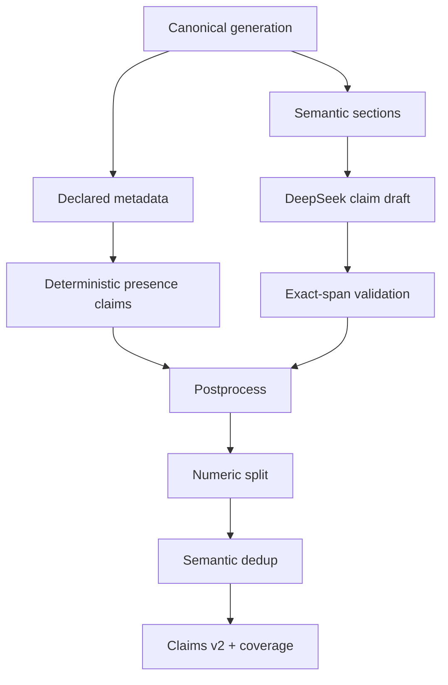

# Claim extraction v2.1 — audit và thiết kế

## Mục tiêu

V2.1 sửa các lỗi thấy trong smoke Haiku ba generations và chuyển provider sang
DeepSeek V4 Flash nhưng vẫn giữ extraction là một bước cấu trúc, chưa phải bước
chấm faithfulness.

## Các lỗi đã sửa

1. `feature_presence`/`concept_presence` không còn phụ thuộc model. Code sinh từ
   declared IDs và neo vào đúng `factor_name`.
2. Số không còn gắn chung vào prediction/direction. Code tách thành claim
   `numeric`, dùng quote số ngắn nhất và gán `numeric_role`.
3. Key model chỉ được giữ để audit. `semantic_signature` ổn định do code tạo mới
   là khóa dùng để dedup và tạo claim ID.
4. Prediction trùng giữa `prediction_summary` và `safe_summary` giữ section ưu
   tiên. Section bị bỏ vì trùng được ghi là semantically redundant, không bị tính
   nhầm là bỏ sót.
5. Feature/concept direction dùng ngôn ngữ “góp phần/đóng góp vào dự đoán” bị
   demote từ `causal` xuống `associational`; metrics ghi rõ số lần code sửa.
6. Mỗi attempt lưu cả lỗi provider/validation, request ID, model provider trả về,
   HTTP status, retry count thực, token usage, response hash và raw body tùy chọn.
7. Cache cũ chỉ được reuse khi cùng source hash, DeepSeek model, extractor version,
   prompt version và canonical prompt SHA-256. Claim Haiku v1 không thể bị reuse nhầm.

## Luồng dữ liệu

## Quy tắc atomicity

- Direction, magnitude, ranking, numeric và causal là các ý riêng khi có thể
  kiểm định độc lập.
- Một claim không được vừa có `feature_id` vừa có `concept_id`.
- Numeric claim bắt buộc có giá trị và role; claim không numeric không giữ giá
  trị số sau hậu xử lý.
- `source_text` luôn phải là exact contiguous quote trong đúng section/factor.
- Index, span, hash, semantic signature và claim ID đều do code xác định.

## Coverage

Coverage được tính trên các source slot không rỗng, ví dụ
`factor_explanation:factor_1`. Một slot là effectively covered khi:

- có ít nhất một claim cuối; hoặc
- chỉ chứa claim ngữ nghĩa trùng với claim đã giữ từ section ưu tiên.

Slot có nội dung mới nhưng không có claim vẫn được ghi trong
`unclaimed_source_slots`. Hệ thống không tự tạo claim giả chỉ để đạt coverage.

## Rủi ro self-model bias

DeepSeek V4 Flash cũng tạo một phần generations trong ma trận. Vì vậy provider
lineage được lưu rõ và DeepSeek ở đây chỉ làm extraction. Không dùng kết quả này
như nhãn đúng/sai cuối. Phase validation cần validator độc lập hoặc human-labeled
calibration set để đo sai lệch theo generation model trước khi chọn threshold.

## Replay ba mẫu smoke thật đã gửi

Raw claim payload Haiku cũ được replay qua postprocessor v2.1; trường
`numeric_role` được ánh xạ tương ứng vì schema v1 chưa có trường này.

| Level | Final claims | Deterministic | Numeric derived | Causal demoted | Dedup | Effective coverage |
|---|---:|---:|---:|---:|---:|---:|
| S0 | 3 | 0 | 0 | 0 | 0 | 1.000000 |
| S1 | 23 | 10 | 1 | 10 | 1 | 1.000000 |
| S2 | 24 | 10 | 1 | 0 | 0 | 0.956522 |

S1 loại đúng prediction lặp ở `safe_summary`. S2 vẫn ghi
`safe_summary` trong `unclaimed_source_slots` vì summary đó có nội dung rộng hơn
nhưng payload cũ không tách claim; code không che lỗi bằng claim giả.

## Acceptance gates

- TypeScript strict typecheck pass.
- Toàn bộ unit/integration tests pass.
- Mọi claim có exact span và SHA-256 hợp lệ.
- Không reuse claim v1/Haiku như success v2.1.
- Provider failure vẫn tạo attempt record đầy đủ.
- Feature/concept deterministic, numeric split và semantic dedup có metrics audit.
- Full run không dùng `--store-raw-responses true` trừ khi có lý do debug rõ ràng.
